# Group7-Komdat-P1

<h1 align="center">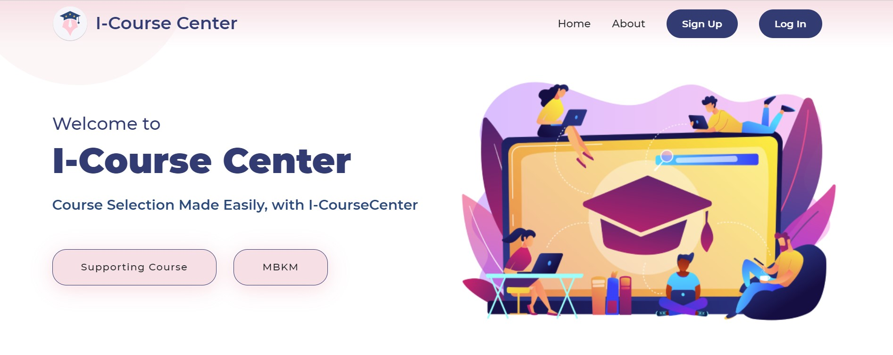</h1>

[Sekilas Tentang](#sekilas-tentang) | [Instalasi](#instalasi) | [Hosting](#hosting) | [Konfigurasi](#konfigurasi) | [Cara Pemakaian](#cara-pemakaian) | [Pembahasan](#pembahasan) | [Referensi](#referensi)
:---:|:---:|:---:|:---:|:---:|:---:|:---:

Akses I-Course Center melalui : https://komdat7jaya.000webhostapp.com/

# Sekilas Tentang
[`^ Back to Top ^`](#)

**I-Course Center** merupakan platform berupa WebApps yang diperuntukan untuk mahasiswa IPB University dalam mempertimbangkan pengambilan keputusan memilih SC/MBKM dengan adanya referensi yang disajikan dan forum diskusi antar mahasiswa. I-Course Center dirancang sebagai web application dengan menggunakan HTML, CSS, PHP, JavaScript, MySQL, XAMPP, serta framework Laravel dan Bootstrap. Fitur-fitur yang disediakan meliputi pencarian referensi SC/MBKM tambahan, preview mata kuliah, dan fasilitas diskusi untuk semua user. 

Akses I-Course Center melalui : https://komdat7jaya.000webhostapp.com/

# Instalasi
[`^ Back to Top ^`](#)

#### Kebutuhan Sistem :
1.  Sistem Operasi: Unix/Linux atau Windows Server.
2.  Web Server: Apache (disarankan) atau Nginx.
3.  PHP: Versi 7.4+ dengan ekstensi yang diperlukan.
4.  Database: MySQL 5.7+ (disarankan) atau alternatif lainnya.
5.  Composer: Instal Composer di server.
6.  Memory (RAM): Minimal 512MB.
7.  Storage: Cukup ruang penyimpanan.
8.  SSL Certificate: Disarankan untuk HTTPS.
9.  Caching: Redis/memcached untuk kinerja.
10.  Keamanan: Firewall dan praktik keamanan.

#### Proses Instalasi Perangkat Lunak :
1. Unduh dan clone **I-Course Center** ke dalam direktori kita. Kemudian jalankan perintah di bawah ini pada command prompt atau terminal:
    ```
    git clone https://github.com/shishimeow/proyek-akhir-rpl-kel4.git
    ```
2. Setelah di-clone, kita perlu membuat file `.env` berdasarkan dari file `.env.example`, caranya jalankan perintah:
    ```
    copy .env.example .env
    ```
3. Instal package-package yang diinstal dalam composer di mana package tersebut akan disimpan dalam folder vendor untuk menjalankan projek dengan framework Laravel. Jalankan perintah berikut di dalam command prompt atau terminal:
   ```
   composer install
   ```
   Setelah berhasil membuat file `.env`, berikutnya jalankan perintah berikut:
   ```
   php artisan key:generate
   ```
4. Kemudian sesuaikan nama database, username, dan password database di file `.env` 
   Jalankan perintah berikut di dalam command prompt atau terminal:
   ```
   php artisan migrate --seed
   ```
   Biasanya, aplikasi yang sudah jadi tidak hanya menyediakan file-file migrations tapi juga file-file seeder untuk data table yang ada di folder database/seeds sehingga 
   kita perlu memasukkannya ke dalam table dengan perintah:
   ```
   php artisan db:seed
   ```
5. Terakhir, untuk membukanya di web browser, jalankan perintah:
   ```
   php artisan serve
   ```
   
# Hosting
[`^ Back to Top ^`](#)

**Layanan hosting yang digunakan:** 000webhost powered by hostinger 

**Setting I-Course Center pada 000webhost:**
1. Buat akun dan registrasi melalui website https://www.000webhost.com/
2. Pada tampilan dashboard pilih section pada menu `File` dan klik `File Manager`. Kemudian upload seluruh file project I-Course Center
   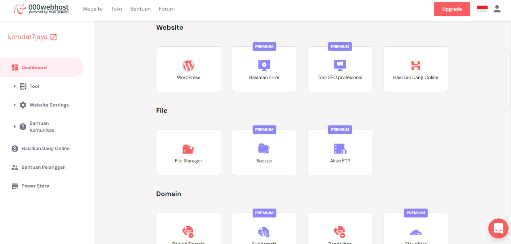 
3. Pindahkan semua file dan folder yang harus diakses oleh publik ke dalam folder `public_html`. Untuk source code atau file yang tidak perlu diakses secara langsung, buat folder baru di luar `public_html` dengan nama "laravel" dan letakkan file-file tersebut di sana. Pada contoh di bawah ini merupakan setting pada folder public_html file index.php /index.html
   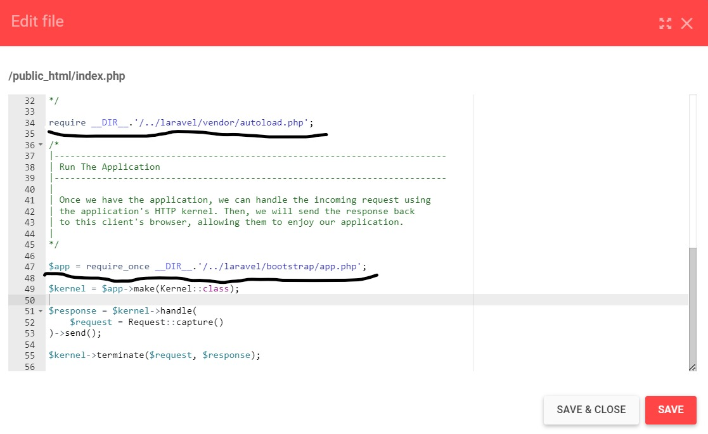
   
5. Pada file `.env` yang berisi berbagai pengaturan penting seperti informasi database, pengaturan cache, pengaturan email, dan banyak lagi dilakukan setting seperti:  
   a. Ganti `APP_URL` dengan URL hosting.    
   b. Sesuaikan `DB_HOST` dengan alamat server database (biasanya "localhost" jika di server yang sama).  
   c. Sesuaikan `DB_DATABASE` dengan nama database.  
   d. Sesuaikan `DB_PASSWORD` dengan kata sandi database.
   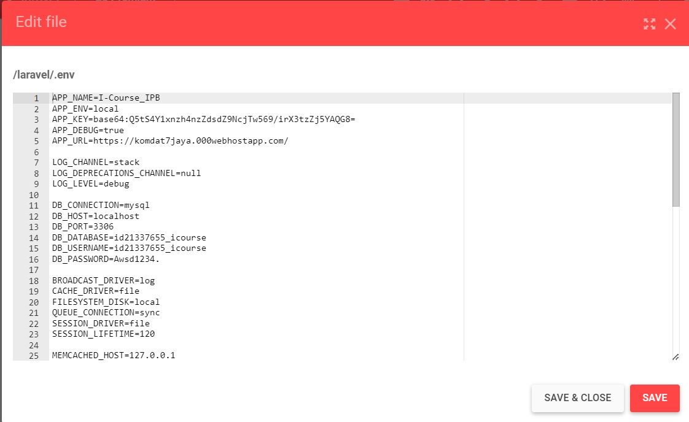

**Setting database I-Course Center**
1. Klik Database Manager: Untuk mengatur database, klik "Database Manager".
2. Ekspor Database Lokal: Sebelumnya, ekspor database yang sudah ada di localhost.
3. Buat Database Baru: Buat database baru dengan memasukkan nama, username, dan password. *Ingat dan catat informasi ini.*
4. Set Database Baru: Klik "phpmyadmin" untuk mengatur database yang baru
   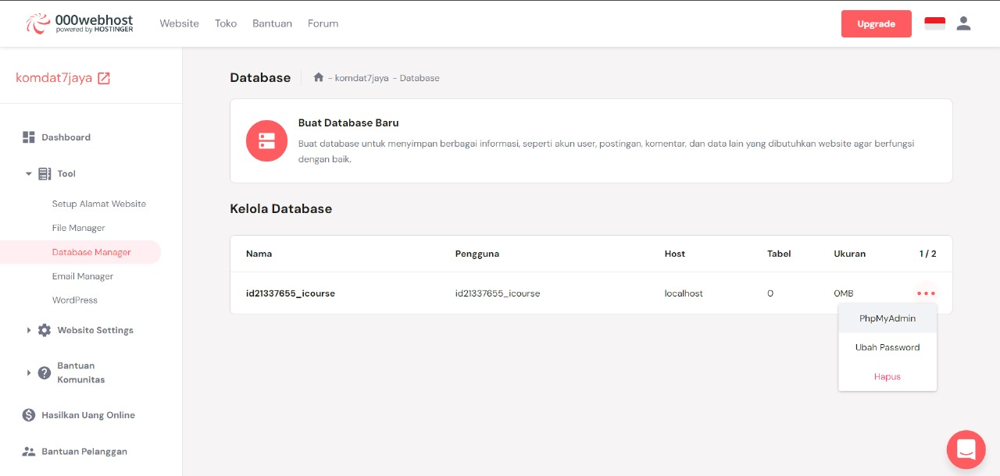  
6. Impor Database: Import database yang telah Anda ekspor ke database baru
   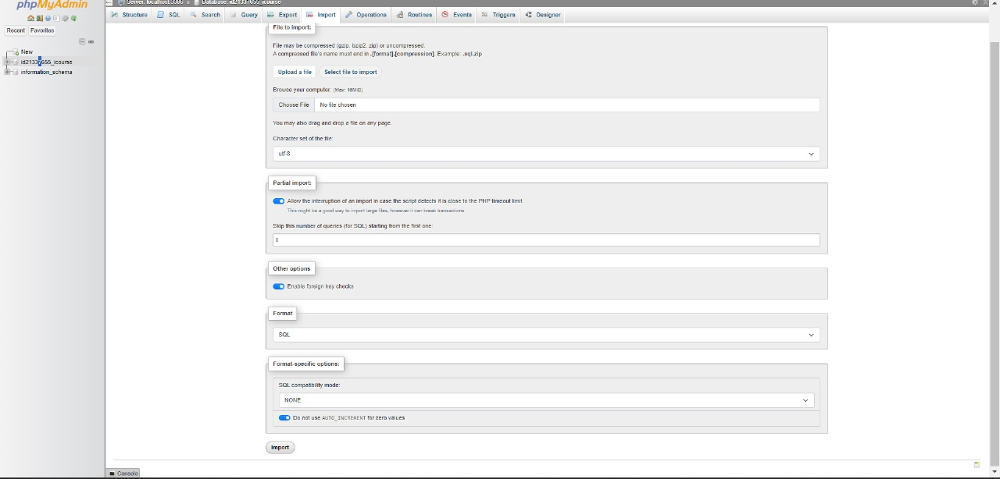

# Konfigurasi
[`^ Back to Top ^`](#)

- Untuk melihat banyaknya dari segi user maupun SC/MBKM dapat melalui `Dashboard admin` yang dapat diakses melalui akun admin
  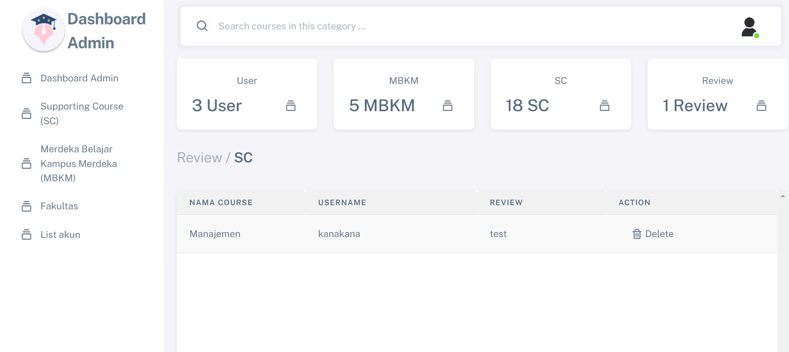
- Untuk memperbaiki informasi atau Create, Read, Update, and Delete (CRUD)  baik dari SC/MBKM dapat melalui menu `Supporting Course (SC)` ataupun `Merdeka Bejalar Kampus Merdeka (MBKM)`
  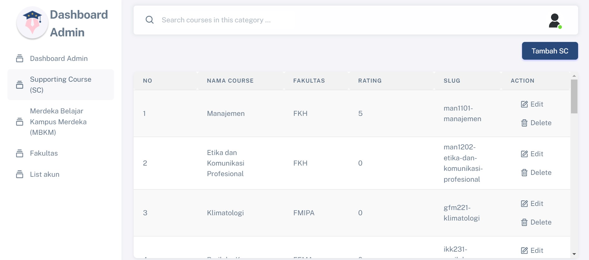
- Untuk memperbaiki informasi atau Create, Read, Update, and Delete (CRUD) dari Fakultas dapat melalui menu `Fakultas`
  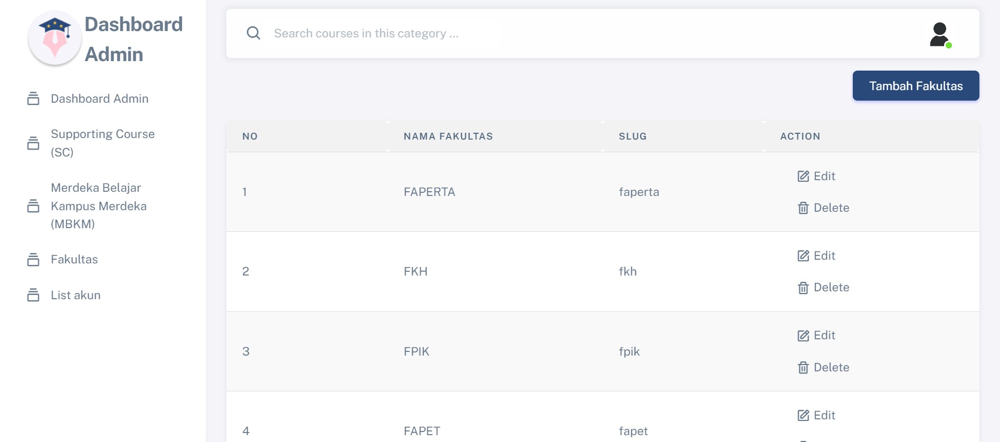
- Untuk Create, Read, Update, and Delete (CRUD) user dapat melalui menu `List Akun`
  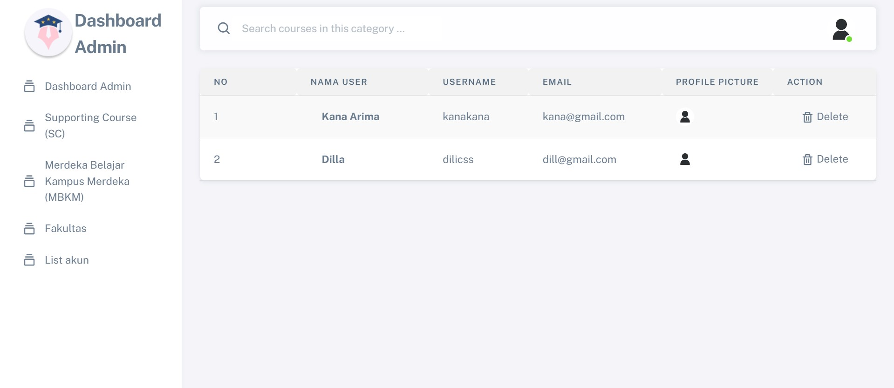

# Maintenance
[`^ Back to Top ^`](#)

Beberapa maintenance dilakukan pada I-Course Center:

**1. Optimisasi Database:**

Tujuan: Meningkatkan performa dan efisiensi database untuk mempercepat respon aplikasi dan mengurangi beban server.

Langkah-langkah:
- Mengidentifikasi query SQL yang lambat dan mengoptimasinya.
- Memeriksa dan mengindeks kolom yang sering digunakan dalam query.
- Menghapus data yang tidak diperlukan atau cadangan yang sudah usang.
- Melakukan monitoring penggunaan sumber daya server dan melakukan tuning jika diperlukan.

**2. Adress Link Backup:**

Tujuan: Memastikan ketersediaan data dan konfigurasi aplikasi dalam kasus kegagalan atau kehilangan data.

Langkah-langkah:
- Melakukan backup rutin data dan file konfigurasi aplikasi.
- Menyimpan cadangan di server terpisah atau layanan penyimpanan awan yang aman.
- Mengatur jadwal backup otomatis yang konsisten.
- Menguji pemulihan dari cadangan secara berkala untuk memastikan keberfungsian backup.

# Cara Pemakaian
[`^ Back to Top ^`](#)

**Cara pemakaian aplikasi terdapat pada penjelasan berikut:**

1. Pada gambar ditunjukkan halaman yang akan pengguna kunjungi ketika pertama kali mengakses webApps I-Course Center. Tampilan ini hanya akan muncul jika pengguna belum   melakukan login atau logout dari I-Course Center. Pada halaman ini, terdapat tiga bagian utama, yaitu bagian Home yang berisi informasi sederhana dari webApps, bagian deskripsi singkat mengenai webApps I-Course Center, dan bagian informasi mengenai pengembang dari webApps I-Course Center.
    
    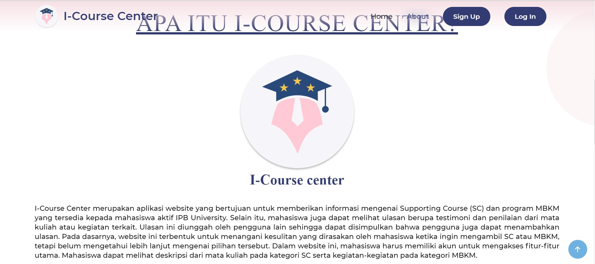

2. Terdapat halaman registrasi atau sign up untuk mendaftarkan akun di webApps I-Course Center. Apabila data yang diterima (username atau email) sudah terdapat dalam database, pengguna tidak bisa mendaftarkan akun yang ditandai dengan munculnya notifikasi. Jika terjadi sebaliknya, pengguna akan langsung diarahkan ke halaman login dan muncul notifikasi yang menandakan registrasi berhasil dilakukan.
   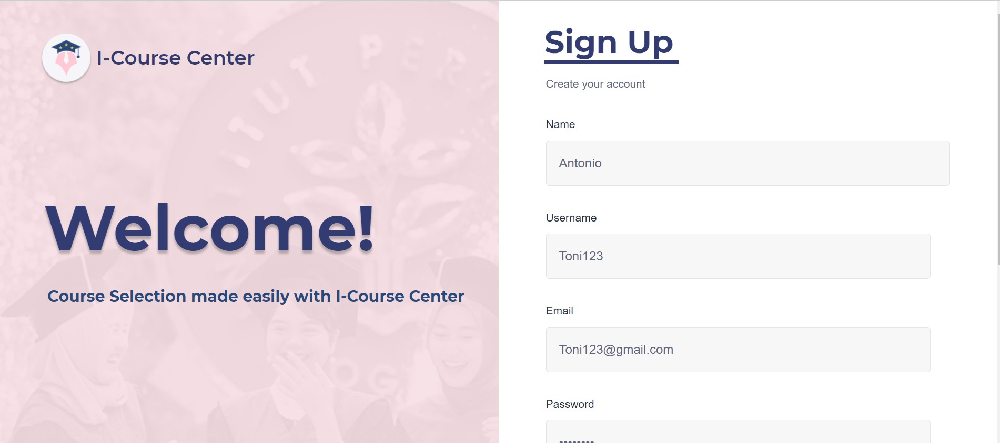
   
3. Terdapat halaman login dari I-Course Center. Pengguna yang sudah memiliki akun dapat memasukkan data akun mereka berupa email atau username dan password yang dimiliki. Jika data yang dimasukkan tidak sesuai dengan yang tersimpan di database, pengguna tidak bisa masuk atau login dengan tanda munculnya notifikasi. Jika terjadi sebaliknya, pengguna akan langsung diarahkan ke halaman selanjutnya. Fitur remember me berfungsi untuk menyimpan token pengguna sehingga data login pengguna tidak akan ter-logout secara otomatis dalam jangka waktu yang sudah ditentukan.
   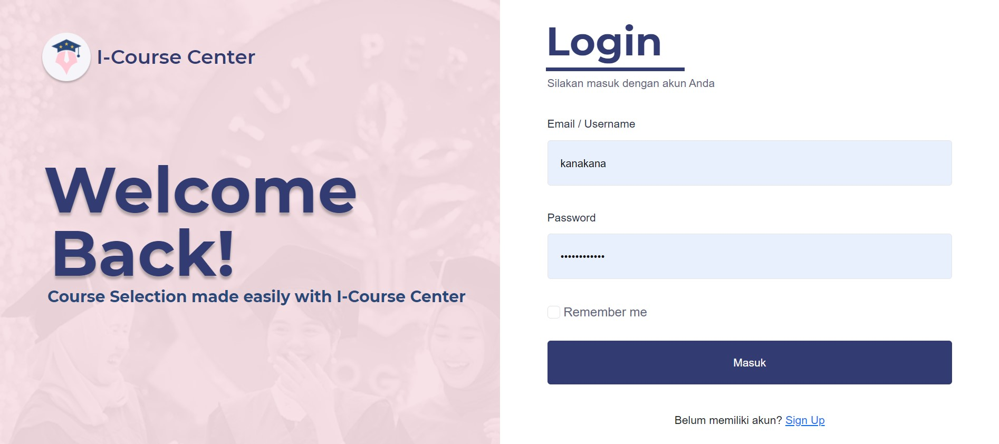

4. Setelah pengguna berhasil melakukan login maka akan berlanjut ke landing page. Halaman ini adalah halaman utama SC. Rating ini diperoleh dari rata-rata rating yang diberikan oleh pengguna lain.
    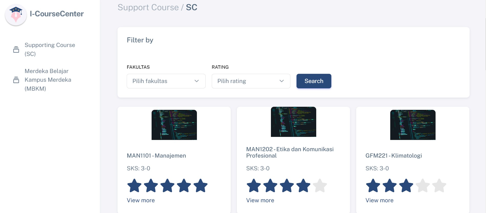

   Terdapat fitur search yang akan selalu tersedia di halaman-halaman lain. 
   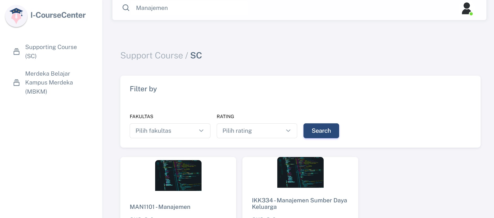

   Pada halaman utama SC, pengguna dapat melakukan penyaringan atau filtering berdasarkan fakultas dan rating yang dimiliki oleh masing-masing SC.
   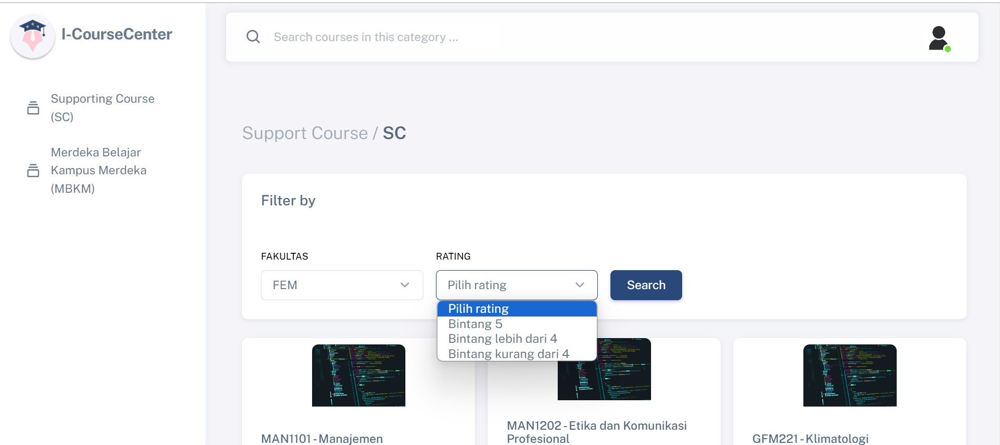
   
5. Pada Gambar ditunjukkan halaman rincian dari SC yang dipilih. Rincian ini meliputi bobot SKS dan deskripsi mata kuliah. 
   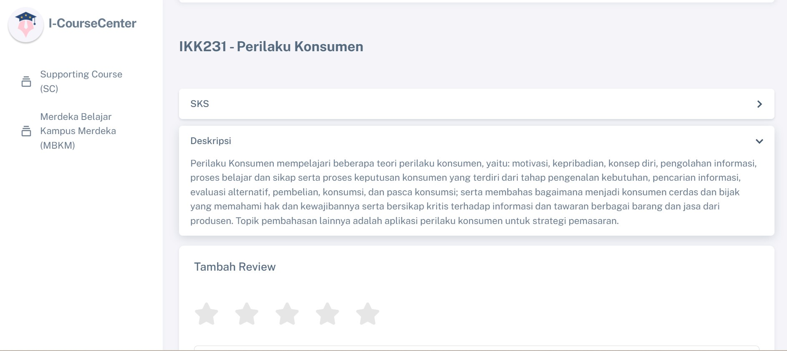
   
   Terdapat juga fitur untuk menambahkan ulasan berupa review dan rating pribadi dari masing-masing pengguna. Fitur ini juga dimiliki oleh halaman rincian MBKM.
   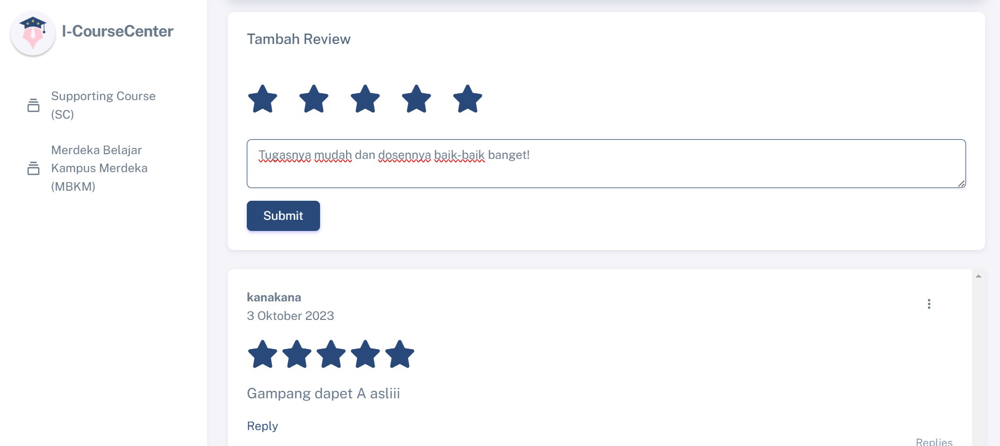
   Pesan jika review berhasil ditambahkan
   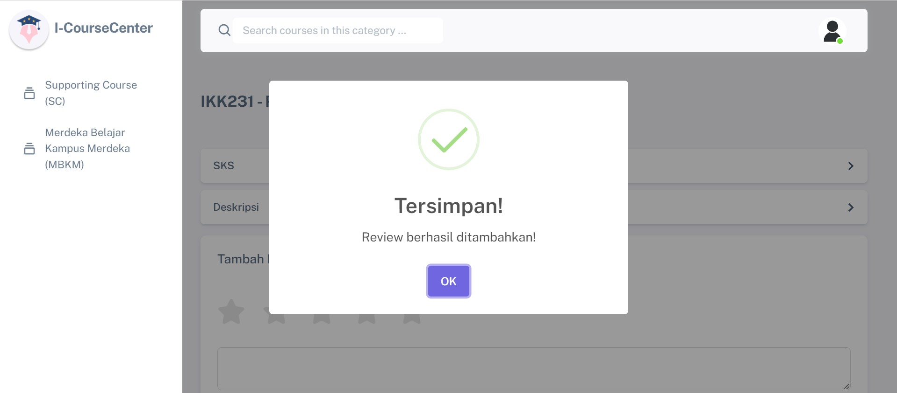
   
6. Pada Gambar ditunjukkan halaman pemberian ulasan, komentar dan pemberian rating SC/MBKM oleh user. 
   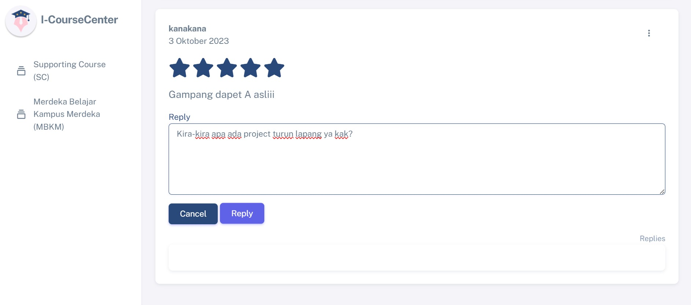
   Terdapat juga forum diskusi  yang menerapkan nested comments sehingga setiap komentar dapat di reply oleh user lain. Terdapat juga fitur untuk hapus dan edit komentar yang sudah dikirim.
   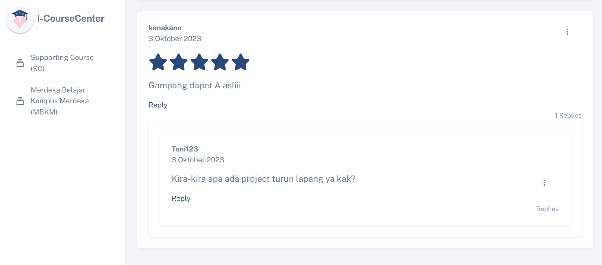
   
7. Selanjutnya pengguna dapat melakukan penyaringan atau filtering berdasarkan periode mulai suatu MBKM dan rating yang dimiliki oleh masing-masing MBKM.
   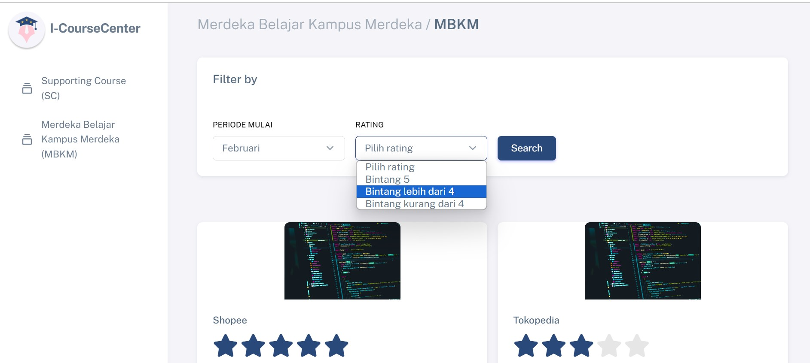
   
8. Selanjutnya ditunjukkan halaman rincian dari MBKM yang dipilih. Rincian ini meliputi periode pendaftaran, benefit, position, dan requirements.
    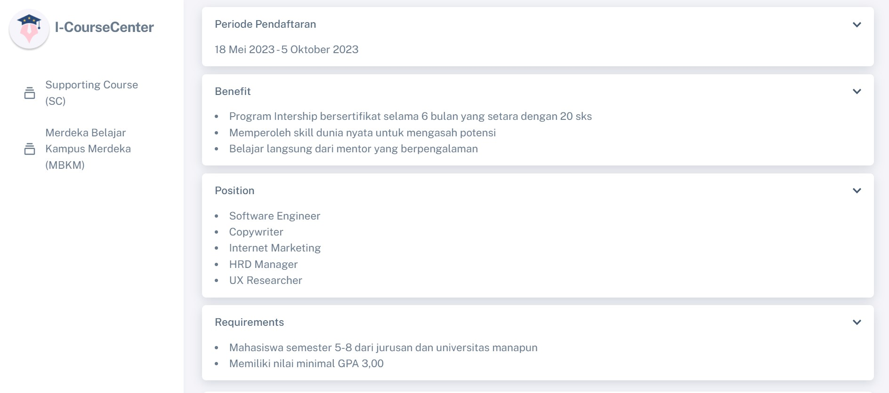
    Terdapat juga fitur untuk menambahkan ulasan berupa review dan rating pribadi dari masing-masing pengguna.
    
    
9. Ketika pengguna menekan bagian settings maka pengguna dapat melakukan kelengkapan data, pembaruan data, dan menambahkan foto akun.
    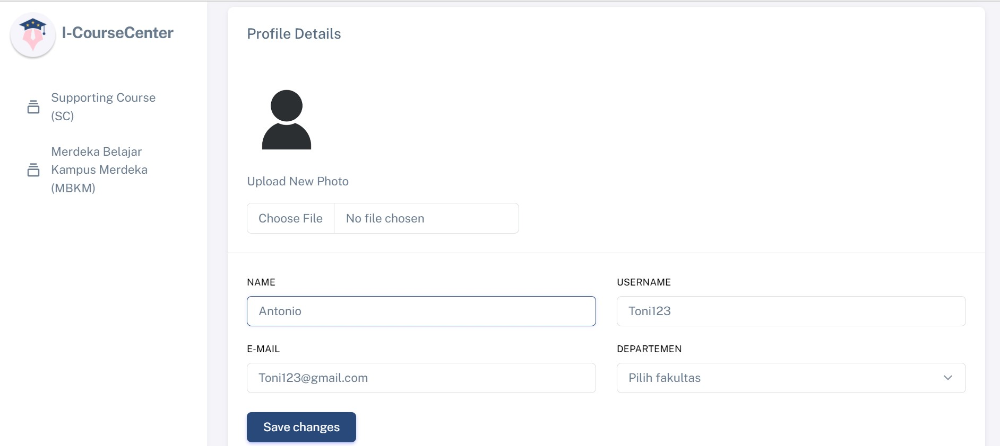
    
10. Selanjutnya terdapat dashboard admin yang dapat diakses dengan login melalui akun admin. Pada halaman admin dapat melihat jumlah user, jumlah MBKM, jumlah SC dan jumlah review. Admin juga dapat menghapus review yang dikirimkan user pada menu SC maupun MBKM. Untuk hal ini sudah dijelaskan pada bagian [Konfigurasi](#konfigurasi)
    

# Pembahasan
[`^ Back to Top ^`](#)

**I-Course Center** merupakan sebuah web application yang dikembangkan dengan PHP untuk pembuatan halaman dinamis, koneksi dengan basis data, pembuatan dan pengelolaan file, pembuatan API dan layanan web, manajemen gambar dan multimedia. JavaScript juga digunakan untuk interaksi pengguna, manipulasi DOM, validasi dan verifikasi input, dan pengembangan aplikasi web. Framework yang digunakan adalah Laravel dan Bootstrap.
Website **I-Course Center** menawarkan berbagai kelebihan diantaranya:
* Penggunaan JavaScript untuk interaksi pengguna membuat aplikasi memiliki desain yang responsive dan dapat disesuaikan dalam berbagai jenis perangkat.
* Kemudahan dalam penggunaan berbagai fitur sehingga efektif dalam mengelola berbagai informasi yang dimasukkan oleh pengguna
* Panel administrasi sederhana dan fleksibel yang memberikan kemudahan dalam mengatur kebutuhan pengguna
  
Namun terdapat juga kekurangan yang didapati seperti:
* Keterbatasan dalam penggunaan memori yang cukup besar sehingga belum bisa mengatasi jumlah pengguna yang banyak
* Layanan hosting gratis yang memiliki tingkat keamanan yang rendah sehingga berisiko terhadap keamanan data mahasiswa dan pengguna

**Comptetitor Analysis**  
Website yang hampir serupa dengan I-Course Center: https://www.ratemycourses.io/
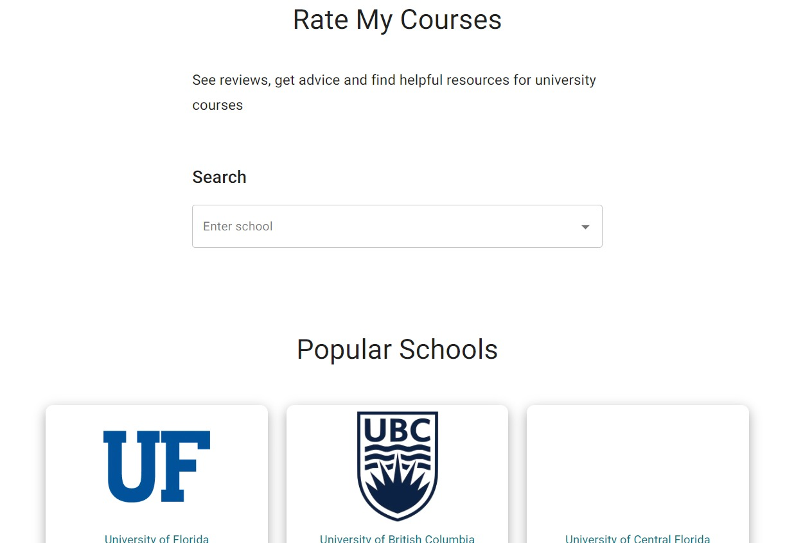

**Ratemycourse.io** adalah sebuah platform yang menyediakan ulasan dan penilaian kursus kuliah. Situs web ini memungkinkan mahasiswa untuk memberikan ulasan dan peringkat terhadap kursus-kursus yang mereka ambil dengan beragam pilihan universitas seperti University of Florida, Pardue University, dsb. Hal ini dapat membantu mahasiswa lain untuk memahami lebih baik tentang kursus-kursus tersebut sebelum mereka mendaftar.

1. Tujuan Utama:
- Ratemycourse.io: Platform ulasan kursus yang menyediakan ulasan dan peringkat kursus kuliah dari berbagai institusi dan program di seluruh dunia. Fokus utamanya adalah memberikan informasi bagi mahasiswa yang mencari kursus tertentu.
- I-Course Center: Platform untuk mahasiswa IPB University yang memberikan informasi tentang program Supporting Course (SC) dan Merdeka Belajar Kampus Merdeka (MBKM) di IPB University. Ini bertujuan untuk membantu mahasiswa IPB dalam pengambilan keputusan memilih SC/MBKM.

2. Cakupan Geografis:
- Ratemycourse.io: Bersifat internasional dan mencakup berbagai institusi pendidikan di seluruh dunia.
- I-Course Center: Terbatas pada IPB University dan fokus pada program-program di universitas tersebut.

3. Jenis Konten:
- Ratemycourse.io: Fokus pada ulasan dan peringkat kursus yang dikemas dalam 3 poin utama (Easiness, Interest, Usefulness) dan ratingnya dikemas dalam bentuk overall dengan warna-warna sesuai review pengguna. RatemyCourse.io juga menyediakan diskusi dan forum untuk pengguna.
- I-Course Center: Memberikan informasi spesifik tentang program-program SC/MBKM di IPB University berbentuk rating dan forum diskusi untuk mahasiswa IPB.

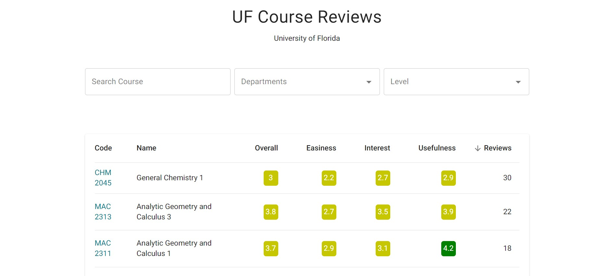

4. Target Pengguna:
- Ratemycourse.io: Terbuka untuk mahasiswa dari berbagai universitas di seluruh dunia.
- I-Course Center: Khusus ditujukan untuk mahasiswa IPB University.

# Referensi
[`^ Back to Top ^`](#)
- [Cara menjalankan aplikasi laravel](https://www.cafeteria.id/2018/08/cara-menjalankan-aplikasi-laravel-hasil.html) - Menjalankan projek
- [Hosting melalui 000webhost](https://pemburukode.com/tutorial-hosting-cara-upload-website-di-000webhost/) - Cara hosting di 000webhost

